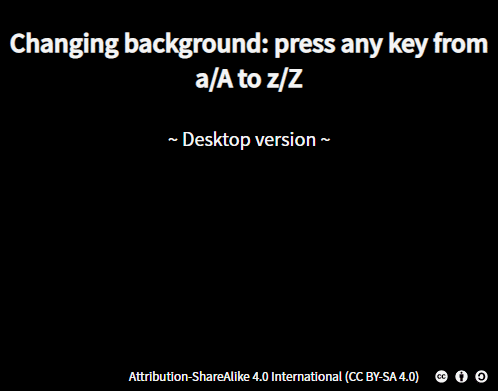

# Changing background colors.

Little project made in a few hours with vainilla JS, to tinker with key events in JS and Sass.

V 1.0 → Only characters from a/A to z/Z (No Ñ yet, sorry 😖).

Hope you enjoy!

📝 If you want cooperate to make a better and more usable version (i.e. to pick up the actual hex color, make a mobile version...), **[don't hesitate to contact me!](mailto:adrianadelteso@gmail.com)**

---

[Attribution-ShareAlike 4.0 International (CC BY-SA 4.0)
](https://creativecommons.org/licenses/by-sa/4.0/)
